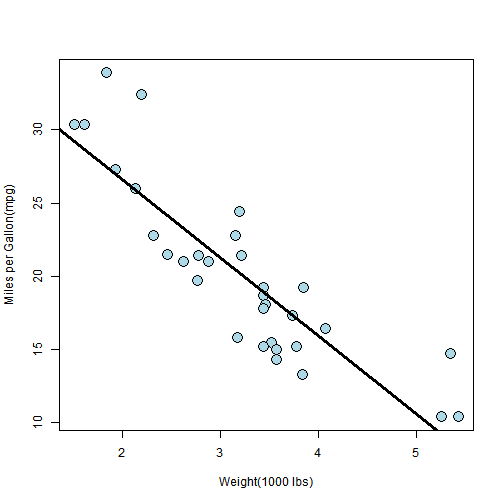

## About

This project is developed as a part of Coursera Data Science Specialization - Developing Data Products Course.

My Shiny application https://zarmeen.shinyapps.io/Developing-Data-Products/ allows users to estimate the slope at which we can have minimum MSE i.e Mean Squared Error.

I have used mtcars Dataset available in R


--- .class #id 

## Dataset


```r
library(datasets)
head(mtcars)
```

```
##                    mpg cyl disp  hp drat    wt  qsec vs am gear carb
## Mazda RX4         21.0   6  160 110 3.90 2.620 16.46  0  1    4    4
## Mazda RX4 Wag     21.0   6  160 110 3.90 2.875 17.02  0  1    4    4
## Datsun 710        22.8   4  108  93 3.85 2.320 18.61  1  1    4    1
## Hornet 4 Drive    21.4   6  258 110 3.08 3.215 19.44  1  0    3    1
## Hornet Sportabout 18.7   8  360 175 3.15 3.440 17.02  0  0    3    2
## Valiant           18.1   6  225 105 2.76 3.460 20.22  1  0    3    1
```

--- .class #id
## Estimating Beta
My shiny app allow user to estimate beta that best fits the linear model between miles per gallon (mpg) and weight (wt) of car

Below code shows how we can get beta from lm function

```r
library(datasets)
fit <- lm(mpg ~ wt,data = mtcars)
fit
```

```
## 
## Call:
## lm(formula = mpg ~ wt, data = mtcars)
## 
## Coefficients:
## (Intercept)           wt  
##      37.285       -5.344
```

--- .class #id
## Plotting mtcars dataset




--- .class #id
## Project Links
1. Github Repo
    https://github.com/zarmeen92/Developing-Data-Products
2. Shiny App
    https://zarmeen.shinyapps.io/Developing-Data-Products/
    
